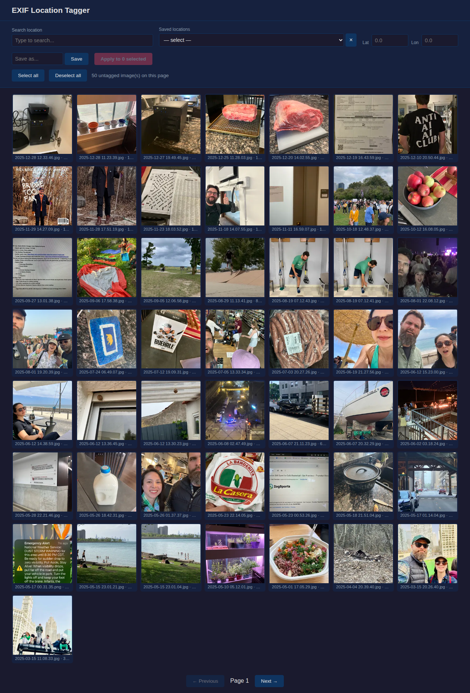

# EXIF Location Tagger for Immich

A local web app for bulk-assigning GPS coordinates to photos stored in [Immich](https://immich.app). Browse untagged images in a grid, search for locations, and apply coordinates to multiple photos at once.



## Why

Many family photos — especially from older cameras or screenshots — lack GPS metadata. Immich groups photos by location, so untagged images are invisible on the map. This tool lets you quickly tag batches of photos with known locations (home, school, parks, etc.).

## Features

- **Thumbnail grid** — paginated view of untagged images (50 per page)
- **Multi-select** — click, Shift+click (range), Ctrl/Cmd+click (toggle), select/deselect all
- **Location search** — autocomplete via [Photon](https://photon.komoot.io/) (free, no API key)
- **Saved locations** — favorite locations persisted locally for quick reuse
- **Bulk apply** — write GPS coordinates to image files via exiftool, then trigger an Immich library rescan

## Architecture

```
Browser (localhost:8000)
    │
    ▼
FastAPI app (Docker)
    ├── Proxies Immich thumbnails
    ├── Searches locations via Photon
    └── Sends GPS write requests to ──►  Exiftool service (Docker, on Immich server)
                                              └── Runs exiftool on the image files
```

GPS coordinates are written directly into image EXIF data (not via the Immich API) because Immich's external library assets re-read EXIF from disk and overwrite API-set metadata.

## Setup

### 1. Exiftool service (on the Immich server machine)

This small service writes GPS data into image files using exiftool.

```bash
cd exiftool-service

# Create .env
cat > .env <<EOF
EXIFTOOL_API_KEY=pick-a-secret-key
PHOTOS_PATH=/mnt/external-photos
EOF

docker compose up -d
```

The `PHOTOS_PATH` should be the same directory Immich's external library reads from.

### 2. Main app (on your local machine)

```bash
# Create .env from template
cp .env.example .env
# Edit .env with your values:
#   IMMICH_URL          - your Immich server URL
#   IMMICH_API_KEY      - from Immich > Account Settings > API Keys
#   EXIFTOOL_URL        - http://your-immich-server:8050
#   EXIFTOOL_API_KEY    - must match the exiftool service key

make up
```

Open http://localhost:8000.

## Usage

1. Browse untagged photos in the grid
2. Select photos (click, Shift+click for range, Ctrl/Cmd+click to toggle)
3. Search for a location or pick from saved locations
4. Click **Apply** — GPS is written to the files and Immich rescans the library
5. The tagged photos disappear from the grid

## Make targets

| Command | Description |
|---|---|
| `make up` | Build and start the app |
| `make down` | Stop the app |
| `make logs` | Tail app logs |
| `make screenshot` | Capture a screenshot of the running app |
| `make exiftool-up` | Start the exiftool service |
| `make exiftool-down` | Stop the exiftool service |
| `make exiftool-logs` | Tail exiftool service logs |

## Tech stack

- **Backend**: Python, FastAPI, httpx, uvicorn
- **Frontend**: Vanilla HTML/CSS/JS
- **Geocoding**: Photon (komoot.io)
- **EXIF writing**: exiftool
- **Packaging**: Docker, uv
